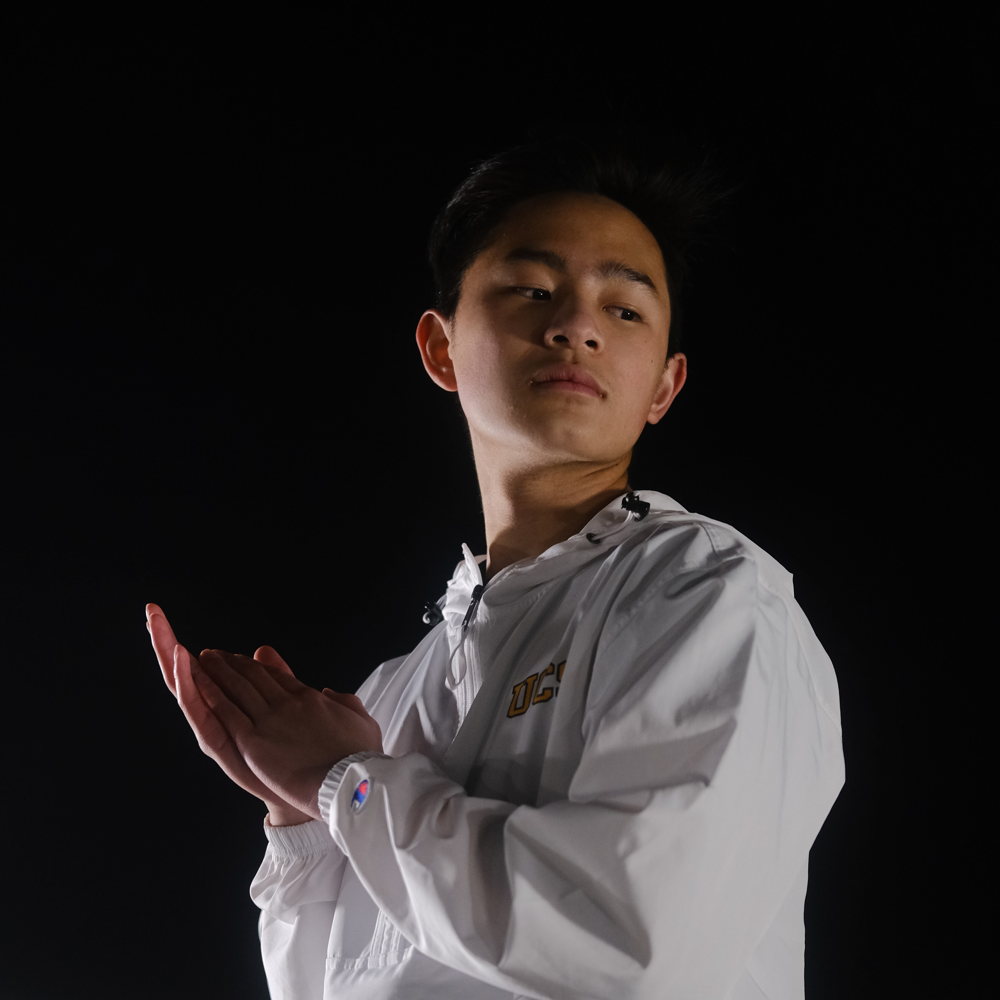
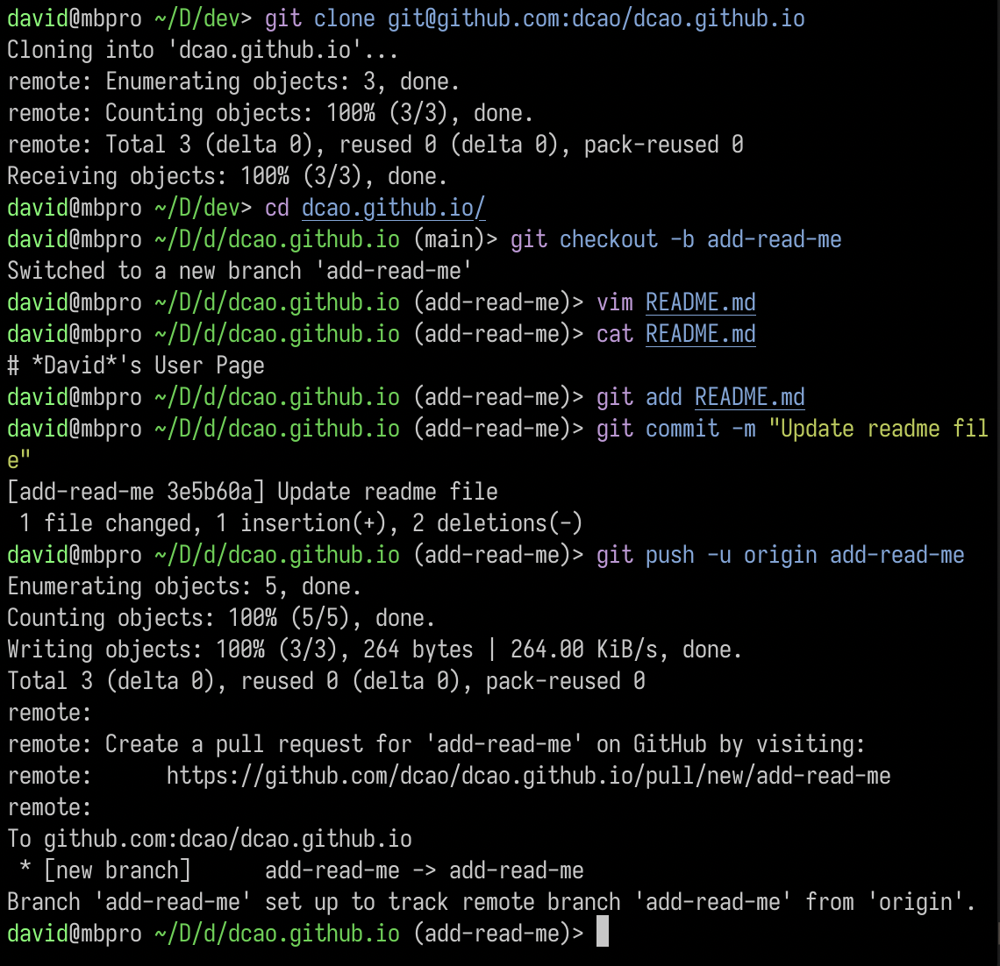
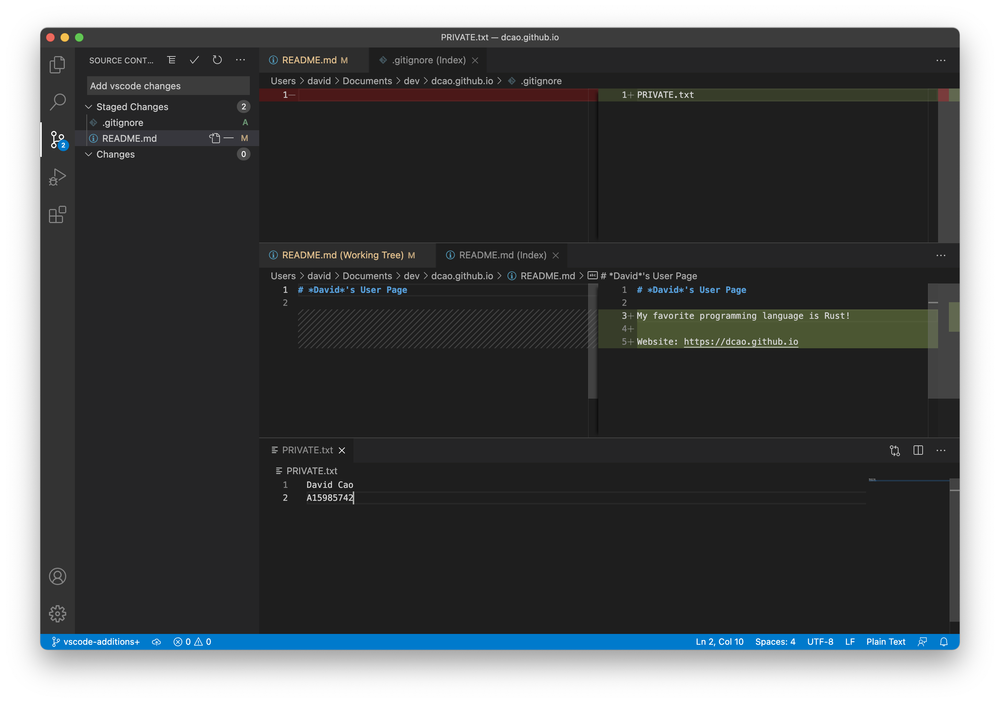

# david cao's github site (for cse 110)



> "what hath god wrought" - numbers 23:23

hi! i'm **david cao**, a ~~1st year~~ 2nd year undergrad majoring in computer science at *uc san diego*.
this isn't my actual website, my real website is [here](https://cao.sh).

for more info, see the [README](./README.md).

## table of contents

- [my hobbies](##my-hobbies)
- [cse 110 goals](##cse-110-goals)
- [contact](##contact)
- [my screenshots](##my-screenshots)

## my hobbies

- i love to dance, and i'm on a dance team on campus!
- i also do wushu, which is a form of performative martial arts
- i'm an avid photographer and videographer too!

## cse 110 goals

- [x] get in the class
- [ ] become a better software engineer!

## contact

to avoid spam, i've put my email in the form of a python script. paste the following in a file called `email.py` and run `python3 email.py` to get it:

```python
#!/usr/bin/env python3

def email():
    data = [100, 109, 99, 97, 111, 64, 117, 99, 115, 100, 46, 101, 100, 117]
    return ''.join([chr(x) for x in data])

print(email())
```

## my screenshots


